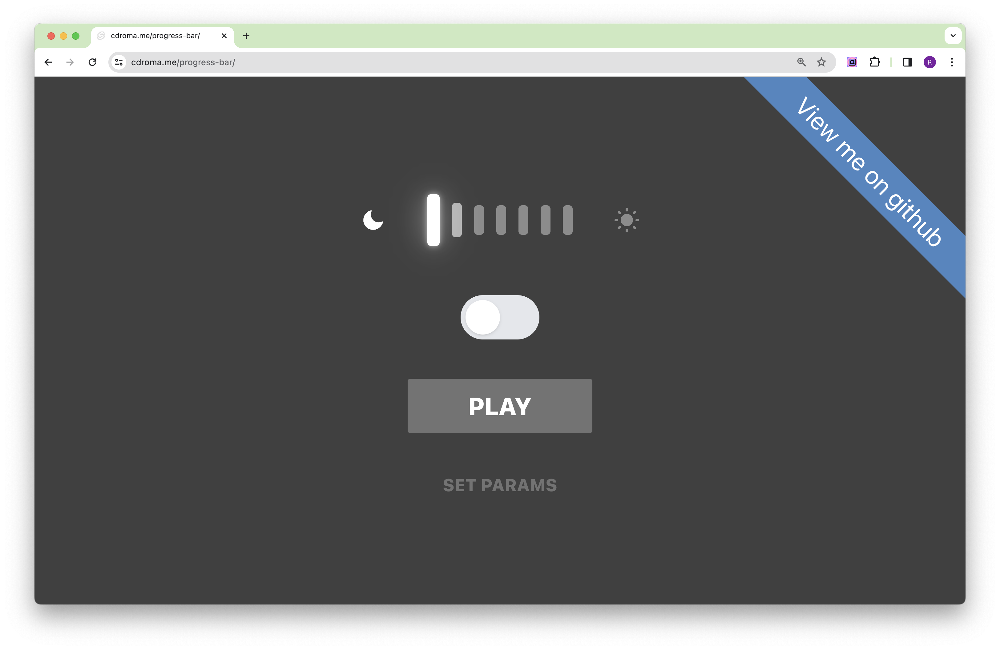

# ProgressBar Component

## Overview



The `ProgressBar` component is a Svelte component designed to display an animated progress bar. It is fully customizable and responsive, making it suitable for a wide range of applications.

## Demo

- [View Demo](https://gthrm.github.io/progress-bar)
- [Histoire](https://share.cdroma.me/w38X4)

## Features

- Animated Progress: Smooth transitions for value changes.
- Customizable Range: Set minimum and maximum values.
- Optimum Value: Highlight an optimum value within the range.
- Responsive: Adjusts to various screen sizes and contexts.

## Usage

To implement the `ProgressBar` component in your project, use the following syntax:

```svelte
<ProgressBar {value} {min} {max} {optimum} />
```

### Props

- `value`: The current progress value. Must be between `min` and `max`.
- `min`: The minimum value (default is `0`).
- `max`: The maximum value that can be reached (default is `100`).
- `optimum`: The optimal value indicating the most favorable progress point.

## Example

First, import the `ProgressBar` component:

```svelte
import ProgressBar from '$lib/components/ProgressBar/index.svelte';
```

Then, you can use it in your application like so:

```svelte
<ProgressBar value={50} min={0} max={100} optimum={75} />
```
